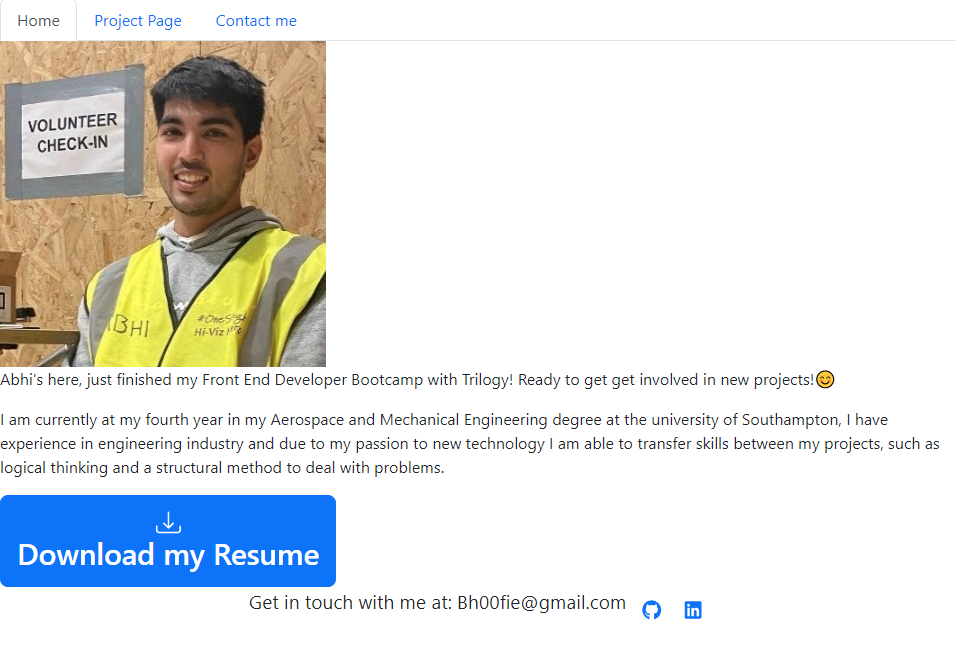

# ReactPortfolio

## Description

This is my personal portfolio in react as well one of my final project of the bootcamp to text my skill in React and NodeJS,

The portfolio contains an introduction to myself, a project page to show case different projects to give the user an understanding of the level of my skills and examples of what I can build. 
The webpage also contain a 'contact me' page that allows the user to send me a message using emailJS and download a copy of my most recent CV. 

## Deployment

The deployed application can be found here: https://ubiquitous-travesseiro-c7dc08.netlify.app/

## Technologies used in the application.

This project has been build in reactJS.

Different Technologies were used in the making of this project, of which:
* EmailJS
* React-Icon
* React Router
* Bootstrap

## Licence

Please refer to the LICENCE in the Repository.

---

